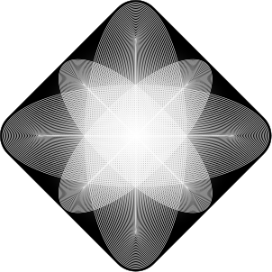
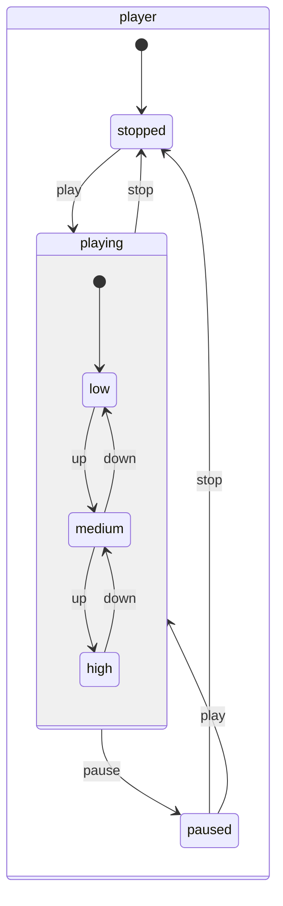

<div align="center">
  

  <h1>Superstate</h1>

  <h3>Type-safe JavaScript statecharts library</h3>

  <div>
    🔒 End-to-end type-safe
    🎯 Easy to read without visualization
    <br/>
    🧩 Highly composable
    ⚡ Lightweight (1.6kB) and fast
  </div>

  <br/>
  <hr />
</div>

Take a look:

```ts
import { superstate } from "superstate";

type PlayerState = "stopped" | "playing" | "paused";

const playerState = superstate<PlayerState>("player")
  .state("stopped", "play() -> playing")
  .state("playing", ["pause() -> paused", "stop() -> stopped"], ($) =>
    $.sub("volume", volumeState)
  )
  .state("paused", ["play() -> playing", "stop() -> stopped"]);

type VolumeState = "low" | "medium" | "high";

const volumeState = superstate<VolumeState>("volume")
  .state("low", "up() -> medium")
  .state("medium", ["up() -> high", "down() -> low"])
  .state("high", "down() -> medium");
```

Even without rendering a chart, it is easy to see the logic.

## Why?

There are many state machine and statechart libraries, including the industry leader [XState](https://stately.ai/docs/xstate). Why bother?

Superstate was [born out of my frustration with TypeScript](https://twitter.com/kossnocorp/status/1771855573304390085). It turned out that typing a graph-based API was an extremely tough challenge, which I bravely accepted.

As statecharts play a central role in any system, set to untangle what is tangled, having complete type-safety is crucial for the task. A typo or unintended usage might ultimately break the app, so the type system must always warn you about the problem.

One reason typing such an API is problematic is the inherent composability of statecharts. This contributes to another problem — readability. That was another reason why I wanted to try my hand at it.

So, when I managed to design an API that is completely type-safe, easy to grasp without visualization, and composable, I thought it would be a crime not to give it a chance and ship it as a library.

So here we go.

## Getting started

### Installation

Start by installing the package:

```sh
npm i superstate
```

### Core concepts

Superstate is an implementation of the statecharts formalism [introduced by David Harel in 1987](https://www.sciencedirect.com/science/article/pii/0167642387900359). It adds hierarchy to state machines, making it possible to express complex logic without losing readability.

To get started, you only need to understand a few concepts:

- **State**: The available system states. Only a single state can be active at a time (e.g. `stopped` or `playing`). A state might have _substates_.
- **Event**: What triggers _transitions_ between the system _states_ (e.g. `up()` or `play()`). You send _events_ to control the system.
- **Transition**: The process of moving from one _state_ to another. It's coupled with the triggering _event_ and the next _state_ (e.g. `up() -> medium`).
- **Action**: What happens during _transitions_, upon entering or exiting a _state_ (e.g. `playMusic!`). _Actions_ call your code.
- **Context**: Data associated with a state. It is passed with _events_ and avaliable on corresponding _states_.

Everything else is built on top of these concepts.

All the concepts have consistent naming, enabling you to quickly distinguish them. For instance, _events_ have `()` at the end, and _actions_ have `!`. The flow of the system is described by `->`.

### Basics

The `superstate` function creates a new statechart. It accepts the name and available states as the generic type and returns the builder object:

```ts
type VolumeState = "low" | "medium" | "high";

const volumeState = superstate<VolumeState>("volume")
  .state("low", "up() -> medium")
  .state("medium", ["up() -> high", "down() -> low"])
  .state("high", "down() -> medium");
```

The first state, `low`, is the initial state that the statechart will enter when it starts. The `state` method accepts the name and list of state traits—in this case—transitions.

The events that trigger state transitions are `up()` and `down()`. Events always have `()` at the end, which makes them easy to spot.

---

To use the machine, run the `host` method:

```ts
const volume = volumeState.host();

// Subscribe to the state updates:
volume.on(["low", "medium", "high"], (target) =>
  sound.setVolume(target.state.name)
);

// Trigger the events:
volume.send.up();

// Check the current state:
if (volume.in("high")) console.log("The volume is at maximum");
```

The method creates an instance of statechart. It's the object that you will interact with, which holds the actual state.

Using the `on` method, you can listen to everything (`*`), a single state or an event, or a combination of them:

```ts
// Listen to everything:
volume.on("*", (target) => {
  if (target.type === "state") {
    console.log("State changed to", target.state.name);
  } else {
    console.log("Event triggered", target.transition.event);
  }
});

// Will trigger when the state is `low` or when `down()` is sent:
volume.on(["low", "down()"], (target) => {
  if (target.type === "state") {
    console.log("The volume is low");
  } else {
    console.log("The volume is going down");
  }
});
```

The `on` method returns `off` function that unsubscribes the listener:

```ts
const off = volume.on("low", () => {});

setTimeout(() => {
  // Unsubscribe the listener:
  off();
}, 1000);
```

### Guards

Transitions can be guarded, allowing to have conditional transitions:

```ts
type PCState = "on" | "sleep" | "off";

const pcState = superstate<PCState>("pc")
  .state("off", "press() -> on")
  .state("on", ($) =>
    $.if("press", ["(long) -> off", "() -> sleep"]).on("restart() -> on")
  )
  .state("sleep", ($) =>
    $.if("press", ["(long) -> off", "() -> on"]).on("restart() -> on")
  );
```

In this example, we used the `if` method to guard the transitions. The `press` event might trigger one of the two transitions: a long press and another for a short press (else).

There are several ways to define state traits, and passing a function as the last argument is one of them. It allows for defining more complex logic.

---

To send an event with a condition, use the `send` object:

```ts
const pc = pcState.host();

// Send the long press event:
const nextState = pc.send.press("long");

// The next state is "off":
if (nextState) nextState.name satisfies "off";
```

Unless it's not in the `off` state, the `press` event will transition the statechart to the `off` state.

If you send the `press()` event without the condition, it might transition to the `sleep` or the `on` state:

```ts
// Send the press event:
const nextState = pc.send.press();

// The next state is "sleep" or "on":
if (nextState) nextState.name satisfies "sleep" | "on";
```

### Actions

Actions allow you to define side effects ran when entering or exiting a state or during a transition.

While you trigger the events, the actions trigger your code:

```ts
type ButtonState = "off" | "on";

const buttonState = superstate<ButtonState>("button")
  .state("off", ["-> turnOff!", "press() -> on"])
  .state("on", ["-> turnOn!", "press() -> off"]);
```

You can notice that the state definitions include strings with `!` at the end, i.e., `turnOn!` and `turnOff!`. These are the actions.

They define what happens when the state is entered and force you to handle the side effects in your code when calling the `host` method:

```ts
// Bind the actions to code:
const button = buttonState.host({
  on: {
    "-> turnOn!": () => console.log("Turning on"),
  },
  off: {
    "-> turnOff!": () => console.log("Turning on"),
  },
});
```

In addition to enter actions (`-> turnOff!`), states can have exit actions (`turnOff! ->`), which are invoked right before the state is left:

```ts
// The on state invokes the enter and exit actions:
const buttonState = superstate<ButtonState>("button")
  .state("off", "press() -> on")
  .state("on", ["-> turnOn!", "press() -> off", "turnOff! ->"]);

const button = buttonState.host({
  on: {
    "-> turnOn!": () => console.log("Turning on"),
    "turnOff! ->": () => console.log("Turning off"),
  },
});
```

The transition actions (`press() -> turnOff! -> off`) are invoked during transitions, before calling the state's exit action (if any):

```ts
// Actions are invoked on transitions:
const buttonState = superstate<ButtonState>("button")
  .state("off", "press() -> turnOn! -> on")
  .state("on", "press() -> turnOff! -> off");

const button = buttonState.host({
  on: {
    "press() -> turnOff!": () => console.log("Turning on"),
  },
  off: {
    "press() -> turnOn!": () => console.log("Turning off"),
  },
});
```

Like with most Superstate API, there are several ways to define actions, allowing you to choose the right one for the situation.

The events and actions can be defined in the builder function or even mixed with the string-based definitions:

```ts
// Use the builder function to define the states:
const buttonState = superstate<ButtonState>("button")
  .state("on", ($) => $.enter("turnOn!").on("press() -> off").exit("turnOff!"))
  .state("off", ($) => $.on("press() -> on"));
```

### Substates

Substates are states that are nested within a parent state. A state might have multiple substates, making it a parallel state, representing concurrent logic:

```ts
type PlayerState = "stopped" | "playing" | "paused";

const playerState = superstate<PlayerState>("player")
  .state("stopped", "play() -> playing")
  .state("playing", ["pause() -> paused", "stop() -> stopped"], ($) =>
    // Nest the volume state as `volume`
    $.sub("volume", volumeState)
  )
  .state("paused", ["play() -> playing", "stop() -> stopped"]);

type VolumeState = "low" | "medium" | "high";

const volumeState = superstate<VolumeState>("volume")
  .state("low", "up() -> medium")
  .state("medium", ["up() -> high", "down() -> low"])
  .state("high", "down() -> medium");
```

In this example, we nest the `volumeState` inside the `playing` state. The `volumeState` will be initialized when the `playing` state is entered and will be destroyed when the `playing` state is exited.

You can send events, subscribe to updates, and access the substate from the parent state:

```ts
const player = playerState.host();

// Send events to the substate:
player.send.playing.volume.up();

// Subscribe to the substate state updates:
player.on("playing.volume.low", (target) => console.log("The volume is low"));

// The parent state will have the substate as a property on `sub`:
const playingState = player.in("playing");
if (playingState) {
  // Access the substate:
  playingState.sub.volume.in("high");
}
```

A state can be final, representing the end of a statechart:

```ts
type OSState = "running" | "sleeping" | "terminated";

const osState = superstate<OSState>("running")
  .state("running", "terminate() -> terminated")
  .state("sleeping", ["wake() -> running", "terminate() -> terminated"])
  // Mark the terminated state as final
  .final("terminated");
```

When nesting such a state, the parent might connect the substate's final states through an event to a parent state, allowing for a more complex logic:

```ts
type PCState = "on" | "off";

const pcState = superstate<PCState>("pc")
  .state("off", "power() -> on")
  .state("on", ($) =>
    $.on("power() -> off")
      // Nest the OS state as `os` and connect the `terminated` state
      // through `shutdown()` event to `off` state of the parent.
      .sub("os", osState, "os.terminated -> shutdown() -> off")
  );
```

When the OS is terminated, the PC will automatically power off.

---

If a substate has actions, they must be bound when hosting the root statechart.

Look at this fairly complex statechart:

```ts
type OSState = "running" | "sleeping" | "terminated";

const osState = superstate<OSState>("running")
  .state("running", [
    "terminate() -> terminated",
    // Note sleep! action
    "sleep() -> sleep! -> sleeping",
  ])
  .state("sleeping", [
    // Note wake! action
    "wake() -> wake! -> running",
    "terminate() -> terminated",
  ])
  .final("terminated", "-> terminate!");

type PCState = "on" | "off";

const pcState = superstate<PCState>("pc")
  .state("off", "power() -> turnOn! -> on")
  .state("on", ($) =>
    // Here we add OS state as a substate
    $.on("power() -> turnOff! -> off").sub(
      "os",
      osState,
      "os.terminated -> shutdown() -> off"
    )
  );
```

The PC (personal computer) statechart nests OS (operating system). The OS has `sleep!` and `wake!` actions, so when we host the PC statechart, we must bind the `OS` actions as well:

```ts
const pc = pcState.host({
  on: {
    // Here we bind the substate's actions
    os: {
      running: {
        "sleep() -> sleep!": () => console.log("Sleeping"),
      },
      sleeping: {
        "wake() -> wake!": () => console.log("Waking up"),
      },
      terminated: {
        "-> terminate!": () => console.log("Terminating"),
      },
    },
    "power() -> turnOff!": () => console.log("Turning off"),
  },
  off: {
    "power() -> turnOn!": () => console.log("Turning on"),
  },
});
```

### Contexts

Superstate allows pairing states with a data structure called context. A state with assigned context will require you to pass the specified data structure when sending events or hosting the statechart.

To define states with context, use the `State` type that you can import from the library:

```ts
// Import the `State` type:
import { State, superstate } from "superstate";

// Specify the context types:

interface Fields {
  email: string;
  password: string;
}

interface ErrorFields {
  error: string;
}

// Define the states

type FormState =
  // Pass the context as the second generic parameter:
  | State<"pending", Fields>
  | State<"errored", Fields & ErrorFields>
  | State<"complete", Fields>
  // You can also mix with strings:
  | "canceled";

// Define the form statechart:

const formState = superstate<FormState>("form")
  .state("pending", [
    "submit(error) -> errored",
    "submit() -> complete",
    "cancel() -> canceled",
  ])
  .state("errored", [
    "submit(error) -> errored",
    "submit() -> complete",
    "cancel() -> canceled",
  ])
  .final("complete")
  .final("canceled");
```

When creating an instance or sending events, you must pass the context data:

```ts
// Pass the initial context:
const form = formState.host({
  context: {
    email: "",
    password: "",
  },
});

// Send submit event:
form.send.submit("-> complete", {
  email: "koss@nocorp.me",
  password: "123456",
});
```

Note that you must specify the destination state (`-> complete`) when sending an event with context, as events with the same name can transition to different states. While it's not a problem when sending events without context, sending context to the wrong state will lead to unexpected behavior.

When sending an event with a condition, specify the condition before the destination state:

```ts
// Send submit with the error condition:
form.send.submit("error", "-> errored", {
  email: "",
  password: "123456",
  error: "Email is missing",
});
```

---

The context will be available on the state and transition objects:

```ts
// Access context via the state:
if (form.state.name === "errored") form.state.context.error satisfies string;

// Receive the context with updates:
form.on("*", (update) => {
  if (update.type === "event") {
    // Access the context in the transition:
    if (update.transition.to === "errored")
      update.transition.context satisfies Fields & ErrorFields;
  } else {
    // Access the context in the state:
    if (update.state.name === "errored")
      update.state.context satisfies Fields & ErrorFields;
  }
});
```

As the context is required, it will always be available on corresponding entities. Superstate guarantees context to always be of the specified type.

---

When sending events, you have to pass a complete context data structure. To make it easier, `send` allows you to pass an updater function with the current context passed as an argument, allowing you to propagate the context from the previous state:

```ts
// Build new context using the previous state context:
form.send.submit("error", "-> errored", ($, context) =>
  $({ ...context, error: "Email is missing" })
);
```

The updater function receives two arguments: the validation functions and the previous context. While the validation function doesn't do anything in the runtime, it guarantees context consistency at the type level. It solves the problem of [TypeScript's structural typing that doesn't prevent returning extra fields that are not part of the context](https://github.com/microsoft/TypeScript/issues/12936). Most of the time, this wouldn't be a problem when dealing with the state the extra fields might lead to unexpected behavior, so the approach with the validation function that triggers type check is a good compromise.

For instance, when transitioning from `errored` state where the `error` property is present, the updater function will trigger a type error when you try to pass the previous `context` as is:

```ts
form.send.submit("-> complete", ($, context) => $(context));
//                                                ~~~~~~~
//> Property 'error' is missing in type 'Fields' but required in type '{ error: never; }'
```

The reason is that the type of `context` is `Fields | (Fields & ErrorFields)`, while the `complete` state expects `Fields`. You can see from the error that the `error` is expected to be never (no pun intended).

To fix the problem, cherry-pick the required properties:

```ts
// Cherry-pick email and password:
form.send.submit("-> complete", ($, { email, password }) =>
  $({ email, password })
);
```

---

Contexts get more powerful when combined with substates. Let's describe a multistep signup form. Let's start with an abstract form statechart builder:

```ts
interface ErrorFields {
  error: string;
}

// Accept form fields generic:
function createFormState<FormFields>() {
  type FormState =
    | State<"pending", FormFields & {}>
    | State<"errored", FormFields & ErrorFields>
    | State<"complete", FormFields & {}>;

  return (
    superstate<FormState>("form")
      .state("pending", [
        // update() will allow use to
        "update() -> pending",
        "submit(error) -> errored",
        "submit() -> complete",
      ])
      .state("errored", [
        "update() -> pending",
        "submit(error) -> errored",
        "submit() -> complete",
      ])
      // Mark the complete state as final:
      .final("complete")
  );
}
```

Now, let's define the main signup statechart:

```ts
interface CredentialsFields {
  email: string;
  password: string;
}

interface ProfileFields {
  fullName: string;
  company: string;
}

// Define the states with the context types:
type SignUpState =
  | "credentials"
  | State<"profile", CredentialsFields>
  | State<"done", CredentialsFields & ProfileFields>;

// Create the credentials form statechart:
const credentialsState = createFormState<CredentialsFields>();

// Create the profile form statechart:
const profileState = createFormState<ProfileFields>();

// Define the signup statechart:
const signUpState = superstate<SignUpState>("signUp")
  .state("credentials", ($) =>
    $.sub("form", credentialsState, [
      // When the form is complete, transition to profile:
      "form.complete -> submit() -> profile",
    ])
  )
  .state("profile", ($) =>
    $.sub("form", profileState, [
      // When the form is complete, transition to done:
      "form.complete -> submit() -> done",
    ])
  )
  .final("done");
```

Note that we bind the `form.complete` states to the next state in the signup statechart. This way, when the form is submitted without errors, the signup statechart will transition to the next state.

Finally, let's take a look how the flow might look like.

First, we create the instance:

```ts
// Since we require the full context in each form initial state, we have
// to specify the initial context for each form:
const signUp = signUpState.host({
  credentials: {
    form: {
      // Initial context for the credentials form:
      context: {
        email: "",
        password: "",
      },
    },
  },

  profile: {
    form: {
      // Initial context for the profile form:
      context: {
        company: "",
        fullName: "",
      },
    },
  },
});
```

We could have made the initial context optional (`State<"pending", Partial<FormFields> >`) and skipped specifying the initial context when hosting, but then you wouldn't learn about it, would you?

Now, let's fill the first form and submit it:

```ts
// Fill in the email field:
signUp.send.credentials.form.update("-> pending", ($, { password }) =>
  $({ email: "koss@nocorp.me", password })
);

// Fill in the password field:
signUp.send.credentials.form.update("-> pending", ($, { email }) =>
  $({ email, password: "123456" })
);

// Submit the form:
signUp.send.credentials.form.submit("-> complete", ($, { email, password }) =>
  $({ email, password })
);
```

If you remember, the `form.complete` state is bound to the `profile` state, so now we should transition to `profile`.

```ts
const profile = signUp.in("profile");
if (profile) {
  // You can access email and password from the profile state:
  const { email, password } = profile.context;
  console.log({ email, password });
}
```

You might have missed it, but we never explicitly assigned the profile state! Where did it get from?!

This is where magic happens! The final substate context automatically merges with the parent context and assign it to the next state.

When binding the final state, Superstate checks if when merging the given final state context with the parent state context produces exact context of the target state. If it doesn't you'll see a type error when trying to bind such states.

Likewise, when submitting the profile form, the `done` state will have both credentials and profile fields:

```ts
// Submit the profile form:
signUp.send.profile.form.submit("-> complete", ($, { fullName, company }) =>
  $({ fullName, company })
);

const done = signUp.in("done");
if (done) {
  // You can access all the context fields:
  const { email, password, fullName, company } = done.context;
  console.log({ email, password, fullName, company });
}
```

## API

The main entry point of the Superstate API is the [`superstate`](#superstate) function that initiates a statechart creation. It returns [the builder object](#builder).

Once initiated, the API has three modes of operation:

- [Builder](#builder) - the object that allows defining state properties. Once all the states are defined, the builder turns into [the factory object](#factory).

- [Factory](#factory) - the object that creates [statechart instances](#instance) and holds the statechart information. It can be used as a substate.

- [Instance](#intance) - the statechart instance created by [the factory](#factory) allows interacting with the statechart.

### `superstate`

The function that initiated a new statechart creation.

```ts
import { superstate } from "superstate";

// Define available states:
type SwitchState = "off" | "on";

// Initiate the "name" statechart creation:
const builder = superstate<SwitchState>("name");
```

It accepts the `name` string as an argument and the generic state type. The `name` is used for visualization and debugging purposes, i.e., to render Mermaid diagrams. The generic type defines the available states.

It returns [the builder](#builder) object that allows you to define each state.

### Builder

The `superstate` method returns a builder object that allows you to define each state one-by-one. The builder object has the following methods:

- [`state`](#builderstate) - defines the state properties.
- [`final`](#buildefinal) - same as the `state` method but marks the state as final.

All methods return the builder object, allowing you to chain the state definitions.

#### `builder.state`

The method defines the state properties, such as transitions, actions, and substates.

```ts
const state = superstate<SwitchState>("name")
  .state("off", "turnOn() -> on")
  .state("on", "turnOff() -> off");
```

The first state in the builder chain is the initial state.

It accepts 1-3 arguments. The first argument is the state name (`name`), followed by optional property string definitions (`defs`) and the optional state builder function (`builder`).

##### `builder.state(_, defs)`

Pass string definitions as the second argument to define the state transitions and actions. The argument can be a `string` or `string[]`.

```ts
const state = superstate<SwitchState>("name")
  .state("off", [
    // Enter action: call `turnOffLights!` action upon entering the state
    "-> turnOffLights!",
    // Exit action: call `turnOnLights!` action upon exiting the state
    "turnOnLights! ->",
    // Transition: when `turnOn()` event is sent, transition to the on state
    "turnOn() -> on",
  ])
  // Transitions with action: call `onOff!` action when `turnOff()` event
  // is sent before transitioning to the `off` state.
  .state("on", "turnOff() -> onOff! -> off");
```

---

There are six types of available definitions:

| Name                           | Definition                                         | Description                                                                                       |
| ------------------------------ | -------------------------------------------------- | ------------------------------------------------------------------------------------------------- |
| Enter action                   | `-> actionName!`                                   | The action that is called when the state is entered.                                              |
| Exit action                    | `actionName! ->`                                   | The action that is called when the state is exited.                                               |
| Transition                     | `eventName() -> nextState`                         | The event that triggers the transition to the next state.                                         |
| Guarded transition             | `eventName(condition) -> nextState`                | The transition is triggered when the event is sent with the given condition.                      |
| Transition with action         | `eventName() -> actionName! -> nextState`          | The event that triggers the transition to the next state and calls the action.                    |
| Guarded transition with action | `eventName(condition) -> actionName! -> nextState` | The transition is triggered when the event is sent with the given condition and calls the action. |

There're no limit on the number of transitions and actions you can define.

→ [Read more about guards](#guards)

→ [Read more about actions](#actions)

##### `builder.state(_, [defs], builder)`

After `name` or `defs`, you can pass a function that accepts the state builder object (`$`).

```ts
// Define the state properties using the state builder object:
const state = superstate<SwitchState>("switch")
  .state("off", ($) =>
    $.enter("turnOffLights!").exit("turnOnLights!").on("turnOn() -> on")
  )
  .state("on", ($) => $.on("turnOff() -> onOff! -> off"));
```

You can combine the string definitions with the builder function:

```ts
// Use both string and builder function definitions:
const state = superstate<SwitchState>("switch")
  .state("off", "-> turnOffLights!", ($) =>
    $.exit("turnOnLights!").on("turnOn() -> on")
  )
  .state("on", ($) => $.on("turnOff() -> onOff! -> off"));
```

You can use `def` and `builder` interchangeably expect when defining the substates. In that case, you must use the builder function:

```ts
type PlayerState = "stopped" | "playing" | "paused";

const playerState = superstate<PlayerState>("player")
  .state("stopped", "play() -> playing")
  .state("playing", ["pause() -> paused", "stop() -> stopped"], ($) =>
    // Define the substate using the builder function:
    $.sub("volume", volumeState)
  )
  .state("paused", ["play() -> playing", "stop() -> stopped"]);

type VolumeState = "low" | "medium" | "high";

const volumeState = superstate<VolumeState>("volume")
  .state("low", "up() -> medium")
  .state("medium", ["up() -> high", "down() -> low"])
  .state("high", "down() -> medium");
```

The state builder also defines the enter and exit actions more explicitly, which some will find easier to read.

---

The state builder has the following methods:

- [`$.on`](#on) - defines the state transitions.
- [`$.if`](#if) - defines the guarded transitions.
- [`$.enter`](#enter) - defines the enter action.
- [`$.exit`](#exit) - defines the exit action.
- [`$.sub`](#sub) - defines the substate.

##### `$.on`

The method defines the state transitions.

```ts
const state = superstate<SwitchState>("name")
  .state("off", ($) => $.on("turnOn() -> on"))
  .state("on", ($) => $.on("turnOff() -> off"));
```

It accepts a `string` or `string[]` as the argument:

```ts
const pcState = superstate<PCState>("pc")
  .state("off", "press() -> on")
  .state("on", ($) =>
    // Chain the transitions:
    $.on("press(long) -> off").on("press() -> sleep").on("restart() -> on")
  )
  .state("sleep", ($) =>
    // Pass all at once:
    $.on(["press(long) -> off", "press() -> on", "restart() -> on"])
  );
```

---

There are four types of available definitions:

| Name                           | Definition                                         | Description                                                                                       |
| ------------------------------ | -------------------------------------------------- | ------------------------------------------------------------------------------------------------- |
| Transition                     | `eventName() -> nextState`                         | The event that triggers the transition to the next state.                                         |
| Guarded transition             | `eventName(condition) -> nextState`                | The transition is triggered when the event is sent with the given condition.                      |
| Transition with action         | `eventName() -> actionName! -> nextState`          | The event that triggers the transition to the next state and calls the action.                    |
| Guarded transition with action | `eventName(condition) -> actionName! -> nextState` | The transition is triggered when the event is sent with the given condition and calls the action. |

##### `$.if`

The method defines a guarded transition. It accepts the event name as the first argument and transition definitions as the second argument.

```ts
const pcState = superstate<PCState>("pc")
  .state("off", "press() -> on")
  .state("on", ($) =>
    // When `press` event with `long` condition is sent, transition to the `off` state.
    // Otherwise, transition to the `sleep` state.
    $.if("press", ["(long) -> off", "() -> sleep"]).on("restart() -> on")
  )
  .state("sleep", ($) =>
    // When `press` event with `long` condition is sent, transition to the `off` state.
    // Otherwise, transition to the `on` state.
    $.if("press", ["(long) -> off", "() -> on"]).on("restart() -> on")
  );
```

The transitions definition is the same as with the `on` method, except that the event name is omitted (`(long) -> off` instead of the complete `press(long) -> off`).

There can be a single transition as well as they can be mixed with the `on` method and even the `state` `defs` argument:

```ts
const pcState = superstate<PCState>("pc")
  .state("off", "press() -> on")
  // Mix with the `defs` argument:
  .state("on", "press() -> sleep", ($) =>
    // Single guarded transition:
    $.if("press", "(long) -> off").on("restart() -> on")
  )
  .state("sleep", ($) =>
    $.if("press", ["(long) -> off", "() -> on"]).on("restart() -> on")
  );
```

---

There are four types of available guarded definitions:

| Name                           | Definition                                | Description                                                                                       |
| ------------------------------ | ----------------------------------------- | ------------------------------------------------------------------------------------------------- |
| Guarded transition             | `(condition) -> nextState`                | The transition is triggered when the event is sent with the given condition.                      |
| Guarded transition with action | `(condition) -> actionName! -> nextState` | The transition is triggered when the event is sent with the given condition and calls the action. |
| Else transition                | `() -> nextState`                         | The transition is triggered when the event is sent without the condition.                         |
| Else transition with action    | `() -> actionName! -> nextState`          | The transition is triggered when the event is sent without the condition and calls the action.    |

→ [Read more about guards](#guards)

##### `$.enter`

The method defines an enter state action. The action is called when the state is entered.

```ts
const state = superstate<SwitchState>("name")
  .state("off", ($) => $.enter("turnOffLights!").on("turnOn() -> on"))
  .state("on", ($) => $.enter("turnOnLights!").on("turnOff() -> off"));
```

You can define any number of enter actions.

→ [Read more about actions](#actions)

##### `$.exit`

The method defines an exit state action. The action is called when the state is exited.

```ts
const state = superstate<SwitchState>("name")
  .state("off", ($) => $.exit("turnOnLights!").on("turnOn() -> on"))
  .state("on", ($) => $.exit("turnOffLights!").on("turnOff() -> off"));
```

##### `$.sub`

The methods defines a substate.

```ts
type PlayerState = "stopped" | "playing" | "paused";

const playerState = superstate<PlayerState>("player")
  .state("stopped", "play() -> playing")
  .state("playing", ["pause() -> paused", "stop() -> stopped"], ($) =>
    // Nest the volume statechart as `volume`
    $.sub("volume", volumeState)
  )
  .state("paused", ["play() -> playing", "stop() -> stopped"]);

type VolumeState = "low" | "medium" | "high";

const volumeState = superstate<VolumeState>("volume")
  .state("low", "up() -> medium")
  .state("medium", ["up() -> high", "down() -> low"])
  .state("high", "down() -> medium");
```

The first argument is the alias of the substate, that will allow you access the substate from the parent state:

```ts
const playing = player.in("playing");
// Access the volume substate:
if (playing) console.log("Is volume high? ", playing.sub.volume.in("high"));

// Or using the dot notation from the parent:
const high = player.in("playing.volume.high");
console.log("Is volume high? ", high);
```

The second argument is the substate factory.

If the substate has final states, you can connect them to the parent state through an event:

```ts
type OSState = "running" | "sleeping" | "terminated";

const osState = superstate<OSState>("running")
  .state("running", "terminate() -> terminated")
  .state("sleeping", ["wake() -> running", "terminate() -> terminated"])
  // Mark the terminated state as final
  .final("terminated");

type PCState = "on" | "off";

const pcState = superstate<PCState>("pc")
  .state("off", "power() -> on")
  .state("on", ($) =>
    $.on("power() -> off")
      // Nest the OS state as `os` and connect the `terminated` state
      // through `shutdown()` event to `off` state of the parent.
      .sub("os", osState, "os.terminated -> shutdown() -> off")
  );
```

The transitions consist of the final substate `os.terminated` (prefixed with the substate name `os`), the event `shutdown()`, and the parent state `off`.

After the substate OS enters the final `terminated` state, the parent PC will receive `shutdown()` and event and automatically transition to the `off` state.

The final transitions can be a `string` or `string[]`, allowing you to connect multiple final states to the parent state.

There are no limits on the number of substates you can define.

→ [Read more about substates](#substates)

#### `builder.final`

The method works like the `state` method but marks the state as final.

[See `state` docs](#builderstate) for more info.

### Factory

Once all the states are defined, the type system will transition [the builder object](#builder) into the statechart factory.

A factory is a statechart definition that allows creating instances using [the `host` method](#host). It can be passed to [the `sub` method](#sub) as a substate.

The factory also makes the statechart information available for debugging and visualization tools.

#### `factory.host`

The method creates a statechart instance that holds the current state and allows you to interact with it, by subscribing to state and event updates, sending events, and checking the current state, etc.

```ts
const player = playerState.host();
```

Once all the states are defined, the type system will make the `host` method available. It creates an instance of the statechart.

```ts
type ButtonState = "off" | "on";

const buttonState = superstate<ButtonState>("button")
  .state("off", "press() -> on")
  .state("on", "press() -> off");
```

If the statechart or its substates have actions, the method argument will allow to bind those actions to the code:

```ts
type ButtonState = "off" | "on";

const buttonState = superstate<ButtonState>("button")
  .state("off", ["-> turnOff!", "press() -> on"])
  .state("on", ["-> turnOn!", "press() -> off"]);

const button = buttonState.host({
  on: {
    "-> turnOn!": () => console.log("Turning on"),
  },
  off: {
    "-> turnOff!": () => console.log("Turning off"),
  },
});
```

The action bindings, allows binding the enter, exit, and transition actions, including all the nested substate actions.

```ts
type OSState = "running" | "sleeping" | "terminated";

const osState = superstate<OSState>("running")
  .state("running", "terminate() -> terminateOS! -> terminated")
  .state("sleeping", [
    "wake() -> wakeOS! -> running",
    "terminate() -> terminateOS! -> terminated",
  ])
  .final("terminated");

type PCState = "on" | "off";

const pcState = superstate<PCState>("pc")
  .state("off", "power() -> powerOn! -> on")
  .state("on", ($) => $.on("power() -> powerOff! -> off").sub("os", osState));

const pc = pcState.host({
  on: {
    // Bind the root's transition action:
    "power() -> powerOff!": () => console.log("Turning off PC"),
    os: {
      // Bind the substate's transition actions:
      running: {
        "terminate() -> terminateOS!": () => console.log("Terminating OS"),
      },
      sleeping: {
        "terminate() -> terminateOS!": () => console.log("Terminating OS"),
        "wake() -> wakeOS!": () => console.log("Waking OS"),
      },
    },
  },
  off: {
    "power() -> powerOn!": () => console.log("Turning on PC"),
  },
});
```

The hierarchy of the statecharts is preserved, so you bind each state and substate actions individually.

When the statechart's or a substate's initial state has assigned context, you must pass the context when hosting the statechart:

```ts
const signUp = signUpState.host({
  // The statechart's initial context:
  context: {
    ref: "unknown",
  },

  credentials: {
    form: {
      // Initial context for the credentials form:
      context: {
        email: "",
        password: "",
      },
    },
  },

  profile: {
    form: {
      // Initial context for the profile form:
      context: {
        company: "",
        fullName: "",
      },
    },
  },
});
```

If all the context fields are optional, you can skip assigning it when hosting the statechart. Otherwise, you'll see a type error.

---

There are four types of available bindings:

| Name              | Definition                   | Description                                                 |
| ----------------- | ---------------------------- | ----------------------------------------------------------- |
| Enter action      | `-> actionName!`             | The action that is called when the state is entered.        |
| Exit action       | `actionName! ->`             | The action that is called when the state is exited.         |
| Transition action | `eventName() -> actionName!` | The action that is called when the transition is triggered. |
| Context           | `context`                    | The context that is passed to the initial statechart state. |

#### `factory.name`

The property holds the statechart name.

```ts
type ButtonState = "off" | "on";

const buttonState = superstate<ButtonState>("button")
  .state("off", "press() -> on")
  .state("on", "press() -> off");

buttonState.name;
//=> "button"
```

### Instance

By calling the [`host`](#factoryhost) method on [the factory object](#factory), you create a statechart instance.

When creating an instance, it enters the initial state, the very first state defined in [the builder](#builder).

The instances allows to interact with the statechart, by listening to state and transition updates, sending events, checking the current state, etc.

Here are the available methods and properties:

- [`state`](#instancestate) - the current state of the statechart.
- [`finalized`](#instancefinalized) - is the statechart in the final state?
- [`in`](#instancein) - checks if the statechart is in the given state.
- [`on`](#instanceon) - subscribes to the state and transition updates.
- [`send`](#instancesend) - proxy object that allows to send events to the statechart.
- [`off`](#instanceoff) - unsubscribes all the statechart listeners.

#### `instance.state`

The property holds the current state of the statechart.

```ts
instance.send.play();

// Check the current state:
instance.state.name;
//=> "playing"
```

#### `instance.finalized`

The property is `true` if the statechart has reached a final state.

```ts
instance.send.terminate();

// Check if the statechart is finalized:
instance.finalized;
//=> true
```

#### `instance.in`

The method checks if the statechart is in the given state.

```ts
// Check if the statechart is playing:
const playingState = instance.in("playing");

if (playingState) {
  playingState.name;
  //=> "playing"
}
```

The first argument is the state name `string` or `string[]`. It returns the state object if the statechart is in the given state or `null` otherwise.

```ts
// Check if the statechart is playing or paused:
const state = instance.in(["playing", "paused"]);

if (state) {
  state.name;
  //=> "playing" | "paused"
}
```

It also accepts the dot-notation path to nested substates.

```ts
// Check if the statechart is in the `on` state and the `os` substate
// is in the `sleeping` state:
const state = instance.in("on.os.sleeping");

if (state) {
  state.name;
  //=> "sleeping"
}
```

When a few overlapping states are passed, the method returns the first state that matches the condition.

```ts
// "on.os.sleeping" is a substate of "on":
const state = instance.in(["on", "on.os.sleeping"]);

if (state) {
  // Will always be "on":
  state.name;
  //=> "on"
}
```

---

There are two types of available checks:

| Name                 | Definition                     | Description                                             |
| -------------------- | ------------------------------ | ------------------------------------------------------- |
| State check          | `state`                        | Check if the statechart is in the given state.          |
| Substate state check | `state.substate.substateState` | Check if the statechart is in the given substate state. |

#### `instance.on`

The method subscribes to the state and event updates.

```ts
// Trigger when the instances tranisitions into the "paused" state:
instance.on("paused", (update) => {
  console.log("The player is now paused");

  update.type satisfies "state";
  update.state.name satisfies "paused";
});

// Trigger when the "pause()" event is sent:
instance.on("pause()", (update) => {
  console.log("The player is paused");

  update.type satisfies "event";
  update.transition.event satisfies "pause";
});
```

The first argument is a `string` or `string[]` of state and event names. The second is the listener that accepts the `update` object containing the state or event information.

The method returns the `off` function that unsubscribes the listener:

```ts
const off = instance.on("paused", () => {});

off();

// Won't trigger the listener:
instance.send.pause();
```

Subscribe to multiple state and event updates at once:

```ts
// Trigger on "pause()" event and "paused" state:
instance.on(["paused", "pause()"], (update) => {
  if (update.type === "state") {
    update.state.name satisfies "paused";
  } else {
    update.transition.event satisfies "pause";
  }
});
```

You can also subscribe to all statechart updates using the wildcard string `*` (note that it **won't subscribe to the substate updates**, use `**` for that):

```ts
// Subscribe to all statechart updates:
instance.on("*", (update) => {
  if (update.type === "state") {
    update.state.name satisfies "stopped" | "playing" | "paused";
  } else {
    update.transition.event satisfies "play" | "pause" | "stop";
  }
});
```

When the statechart has substates, you can subscribe to the substate updates using the dot-notation path:

```ts
// Subscribe to substate updates:
instance.on(["playing.volume.down()", "playing.volume.low"], (update) => {
  if (update.type === "state") {
    update.state.name satisfies "low";
  } else {
    update.transition.event satisfies "down";
  }
});
```

To subscribe to all substate updates, use the wildcard string (`state.substate.*`):

```ts
// Subscribe to all substate updates:
instance.on("playing.volume.*", (update) => {
  if (update.type === "state") {
    update.state.name satisfies "low" | "medium" | "high";
  } else {
    update.transition.event satisfies "up" | "down";
  }
});
```

It's also possible to subscribe to all the updates including the root and substates using the double wildcard string (`**`):

```ts
// Subscribe to all updates:
instance.on("**", (update) => {
  if (update.type === "state") {
    update.state.name satisfies
      | "stopped"
      | "playing"
      | "paused"
      | "low"
      | "medium"
      | "high";
  } else {
    update.transition.event satisfies "play" | "pause" | "stop" | "up" | "down";
  }
});
```

---

There are seven types of available update targets:

| Name                  | Definition                       | Description                                                        |
| --------------------- | -------------------------------- | ------------------------------------------------------------------ |
| Statechart updates    | `*`                              | Subscribe to all the statechart updates.                           |
| State update          | `state`                          | Triggered when the statechart transitions into the state.          |
| Event update          | `event()`                        | Triggered when the event is sent to the statechart.                |
| Substate state update | `state.substate.substateState`   | Triggered when the statechart transitions into the substate state. |
| Substate event update | `state.substate.substateEvent()` | Triggered when the event is sent to the substate.                  |
| All substate updates  | `state.substate.*`               | Subscribe to all the substate updates.                             |
| All updates           | `**`                             | Subscribe to all the statechart and substate updates.              |

#### `instance.send`

This proxy object allows to send events to the statechart.

```ts
instance.on("playing", () => console.log("Playing!"));

// Send "play()", trigger the listener and print "Playing!":
instance.send.play();
```

Pass the condition as the argument to trigger the guarded event:

```ts
const instance = pcMachine.host();

instance.on("press(long)", () => console.log("Pressed long"));

// Won't trigger the listener:
instance.send.press();

// Will trigger the listener and print "Pressed long":
instance.send.press("long");
```

The event methods return the next state if the event leads to a transition or `null` otherwise:

```ts
const nextState = instance.send.play();

// If the event triggered a transition, send will return the playing state:
if (nextState) {
  nextState.name satisfies "playing";
}
```

To send the event to a substate, access it by the parent state and the substate's name:

```ts
instance.on("playing.volume.up()", () => console.log("Volume up!"));

// Will trigger the listener and print "Volume up!":
instance.send.playing.volume.up();
```

When sending the event transitions to a state with a context, you have to pass the destination and the context as arguments:

```ts
instance.send.form.submit("-> complete", {
  email: "koss@nocorp.me",
  password: "123456",
});
```

When sending a guarded event with a context, pass the condition as the first argument:

```ts
instance.send.form.submit("error", "-> errored", {
  email: "",
  password: "123456",
  error: "Email is missing",
});
```

#### `instance.off`

The method unsubscribes all statechart update listeners.

```ts
instance.on("playing", () => console.log("Playing!"));

// Unsubscribe from all the updates:
instance.off();

// Won't trigger the listener:
instance.send.play();
```

### Mermaid

Superstate comes with Mermaid support, allowing you to visualize a statechart as a diagram.

#### `toMermaid`

The method renders the passed statechart as a Mermaid diagram code:

```ts
import { superstate } from "superstate";
import { toMermaid } from "superstate/mermaid";

type VolumeState = "low" | "medium" | "high";

const volumeState = superstate<VolumeState>("volume")
  .state("low", "up() -> medium")
  .state("medium", ["up() -> high", "down() -> low"])
  .state("high", "down() -> medium");

type PlayerState = "stopped" | "playing" | "paused";

const playerState = superstate<PlayerState>("player")
  .state("stopped", "play() -> playing")
  .state("playing", ["pause() -> paused", "stop() -> stopped"], ($) =>
    $.sub("volume", volumeState)
  )
  .state("paused", ["play() -> playing", "stop() -> stopped"]);

const mermaid = toMermaid(playerState);
```

Here's the `mermaid` result:

```
%% Generated with Superstate
stateDiagram-v2
	state "player" as player {
		[*] --> player.stopped
		player.stopped --> player.playing : play
		player.playing --> player.paused : pause
		player.playing --> player.stopped : stop
		player.paused --> player.playing : play
		player.paused --> player.stopped : stop
		state "stopped" as player.stopped
		state "playing" as player.playing {
			[*] --> player.playing.low
			player.playing.low --> player.playing.medium : up
			player.playing.medium --> player.playing.high : up
			player.playing.medium --> player.playing.low : down
			player.playing.high --> player.playing.medium : down
			state "low" as player.playing.low
			state "medium" as player.playing.medium
			state "high" as player.playing.high
		}
		state "paused" as player.paused
	}
```

Which can be rendered as a diagram [using the Mermaid library](https://mermaid.live/edit#pako:eNqdk7FuwyAQhl_lhJSlijN0ZOhUqQ-QsXRA4WqjxhhhqBVFfvcCNirEpK06cbr7_uP4gSs5DQIJJbsdvKBCwy0KmKTt4Og0mtH6BFNxeZa8NbxvPh-ZYjamgBF95hc0jAAfYYnhGurMvj68QdM8rdnDaAetUSy1MpdjYZGqBRoTBZ1KOc3d6PUeDsFvdNqOQohKemn0x0E2cK1zcigdPLOoNCO30u9YgGmK1dONq2v9cB6mRGwrNUGPQrreD-z0HeFKVLSdbLv_KcMwFMQwqTvS2PqncXNtMi4cvmJabkpClz5Vei3dCMJAVTwWIjzfXGN8HaVmSXlsJns_g-m5FP7X-VsFr7Ad9sgI9aHg5oMRpgLHnR2OF3Ui1BqHe-K0-P6GhL7z84jzF6NHX40):



## Acknowledgments

Special thanks to [Eric Vicenti](https://github.com/ericvicenti) for donating the npm package name `superstate` to this project.

The project wouldn't exist without the [XState](https://stately.ai/docs/xstate) library, a great source of inspiration and knowledge.

## Changelog

See [the changelog](./CHANGELOG.md).

## License

[MIT © Sasha Koss](https://kossnocorp.mit-license.org/)
